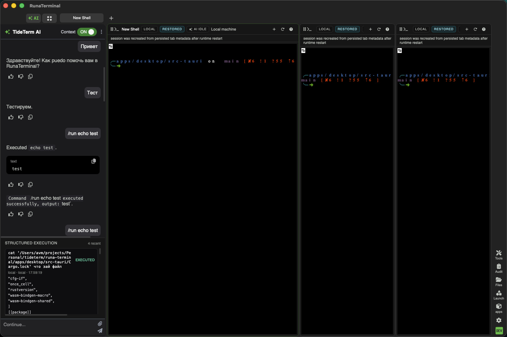
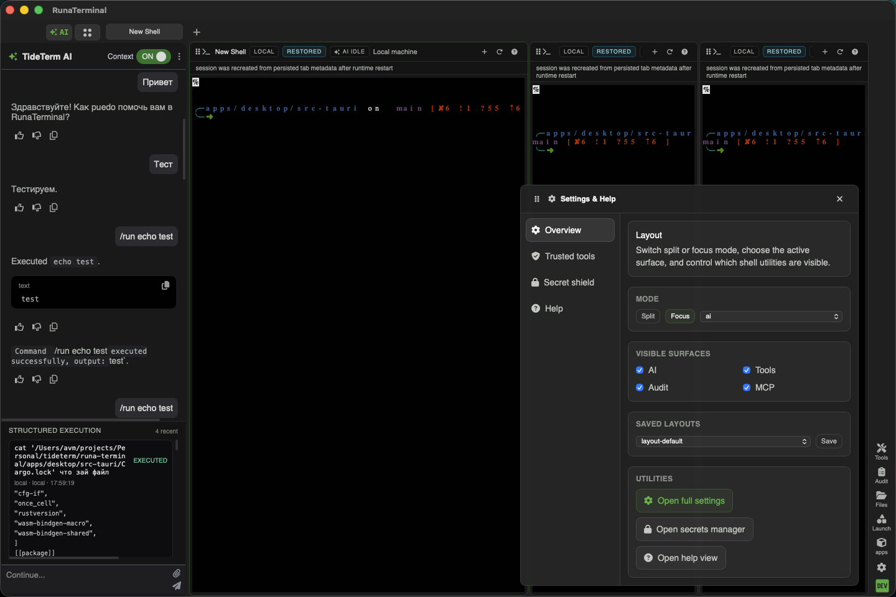
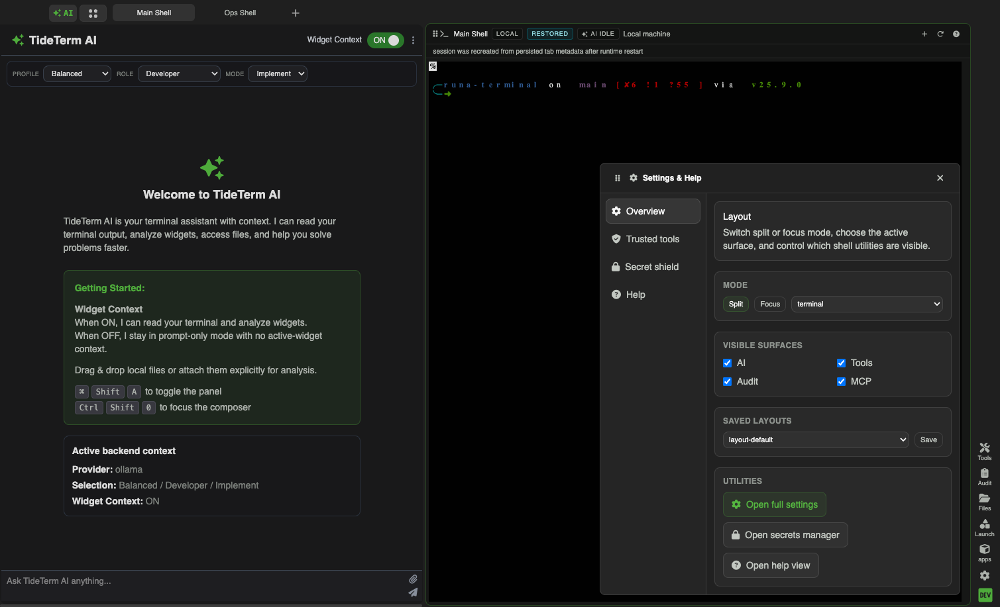
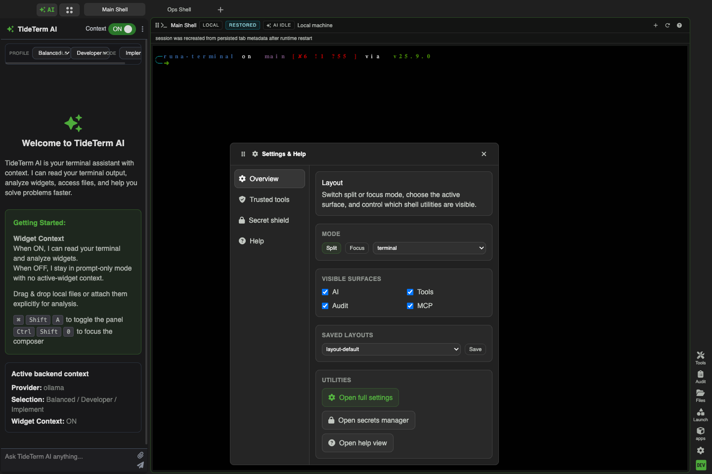

# UI System Parity Validation

Date: `2026-04-18`
Phase: `1.0.0-rc1` hardening
Status: `validated with remaining visible mismatch`

This validation used all three reference inputs for the UI-system batch:

- Tide source files listed in [docs/ui-system-parity-gap-map.md](./ui-system-parity-gap-map.md)
- Tide screenshot reference: `tideterm/docs/docs/img/wave-screenshot.webp`
- fresh post-fix RunaTerminal screenshots from both the real desktop app and a headed / visible browser run

## Exact desktop validation flow

1. Started the real desktop runtime with:
   - `npm run tauri:dev`
2. Confirmed the live Tauri launch output:
   - `{"base_url":"http://127.0.0.1:51194","pid":61512}`
3. Queried the visible desktop window via `System Events`:
   - title: `RunaTerminal`
   - position: `560, 143`
   - size: `1440, 960`
4. Captured the visible shell window directly:
   - `screencapture -R560,143,1440,960 desktop-after-slice5-shell-front.png`
5. Opened the settings overlay in the real Tauri window with a native click on the right-rail settings icon:
   - `swift -e '...CGEvent mouse click...'`
6. Captured the visible desktop overlay state:
   - `screencapture -R560,143,1440,960 desktop-after-reopen-settings.png`

## Exact headed browser flow

1. Used a visible Playwright browser session against `http://127.0.0.1:5188/`.
2. Set the viewport to desktop size:
   - `1440 x 960`
3. Opened the settings overlay from the right utility rail and captured the result.
4. Dragged the overlay by the header in the headed browser and captured the moved state.
5. Dragged the overlay past the top-left edge and recorded bounded movement:
   - before: `{x:465,y:289,width:544,height:653}`
   - after: `{x:18,y:18,width:544,height:653}`
6. Manually opened and checked these shell-adjacent surfaces in the same headed session:
   - `Settings & Help`
   - `Tools`
   - `Audit`
   - `Files`
   - `Launcher`
7. In the same headed validation window, confirmed launcher entries for:
   - MCP controls
   - remote profile actions
8. Ran the repo release sweep on the corrected code state:
   - `npm run validate`
   - result: passed, with the existing frontend hook warnings only
9. Ran the existing headed UI/browser regression pack:
   - `npx playwright test e2e/ui-parity.spec.ts e2e/panels-parity.spec.ts e2e/shell-chrome-parity.spec.ts e2e/navigation-parity.spec.ts e2e/quick-actions.spec.ts e2e/structured-execution-block.spec.ts e2e/window-behavior.spec.ts -c e2e/playwright.config.ts --headed`
   - result: `7 passed`, `3 failed`, `2 did not run`
   - the passing cases covered quick actions, MCP controls, structured execution, and remote-profile quick-action context
   - the failing cases were stale UI parity assertions/selectors, not new runtime behavior failures:
     - `e2e/navigation-parity.spec.ts`
     - `e2e/shell-chrome-parity.spec.ts`
     - `e2e/ui-parity.spec.ts`

## New post-fix screenshots

Desktop shell:

Desktop settings overlay:

Headed browser settings overlay:

Headed browser dragged settings overlay:

## Direct visual comparison vs Tide

Tide reference used:

### Overlay model

- Before this batch, the settings surface read as a centered modal.
- After the fix, both desktop and headed browser renders show a true floating overlay near the utility rail.
- The headed browser drag/clamp result confirms real bounded movement instead of layout-coupled pseudo-dragging.

### Terminal header / block chrome

- The compat terminal header is now visibly thinner and more Tide-like than the pre-fix header.
- Header actions now sit in compact end-icon chrome instead of full text buttons floating over the pane.
- Pane borders and header fills now read as one chrome system instead of mixed cyan/debug styling.

### Shell chrome density

- The right rail is visibly slimmer and less dominant than the pre-fix state.
- Pane spacing and outer shell padding are tighter, which makes the shell read closer to Tide’s compact hierarchy.

### Font / icon system

- The visible parity path now consistently uses the Font Awesome asset family plus `Inter` / `Hack`.
- Icon scale is more uniform across the right rail, settings nav, and pane headers than in the pre-fix screenshots.

## Verified honestly

- real Tauri desktop shell launch and screenshot capture
- real Tauri desktop settings overlay opening and screenshot capture
- headed / visible browser settings overlay opening
- headed / visible browser overlay dragging
- headed / visible browser overlay boundedness (`18px` clamp at top and left)
- settings view switching across `Overview`, `Trusted tools`, `Secret shield`, and `Help`
- terminal header compactness and icon-only action chrome
- shell top chrome density and right-rail density
- tools panel opening, including visible MCP controls section
- audit panel opening
- files panel opening
- launcher opening
- quick-actions / MCP / structured-execution / window-behavior / remote-profile quick-action flows through the headed spec pack
- repo release sweep via `npm run validate`

## Remaining visible mismatch

- The compat terminal header still relies on explicit status badges (`LOCAL`, `RESTORED`, `AI IDLE`) that read heavier than Tide’s quieter inline header treatment.
- The settings overlay is much closer to Tide than before, but it still reads darker and more form-heavy than the Tide screenshot family.
- The active shell composition still differs from the Tide screenshot family at the whole-window level because the current compat shell keeps the left AI panel and a different pane mix.

Browser validation above was headed and visible, not hidden/headless. Desktop validation above was run against the real visible Tauri runtime.
